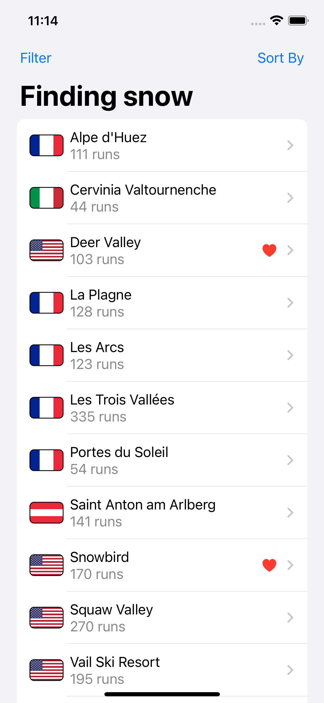
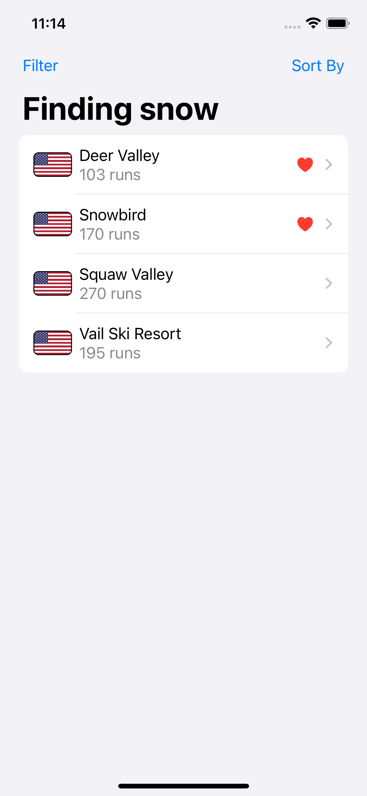
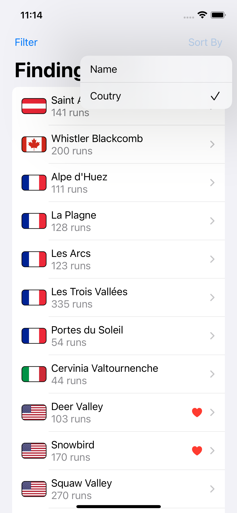
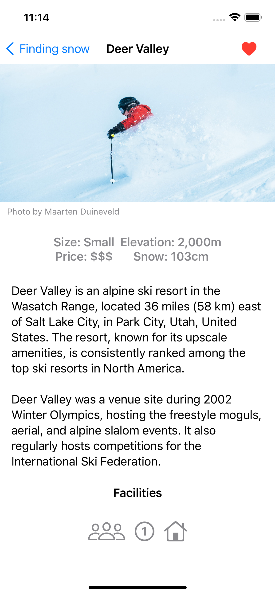

# SnowSeeker
This is the last project from 100 Days of SwiftUI Course. User can learn about some snow resorts (all information is fiction), like resorts (data saves using Core Data), Sort and Filter resorts! Sort by name and country, and filter by country, size and price. This app is also optimized for iPad.

   
